# Early Pallial Neurogenesis

To add :
- graphical abstract
- link to the paper

## Download raw and processed datasets

To add :
- link to download raw dataset (GEO filtered_gene_bc_matrix)
- link to download processed dataset (GEO to tsv file bdc and meta.data of all cells)
- link to GEO for the fastq

## Code to quality control and preprocessing

[Preprocessing and QC script](./html-Reports/Quality_Control.html)

## Code to main figures

| Figure 1 | Figure 2 | Figure 5 |
|-|-|-|
| [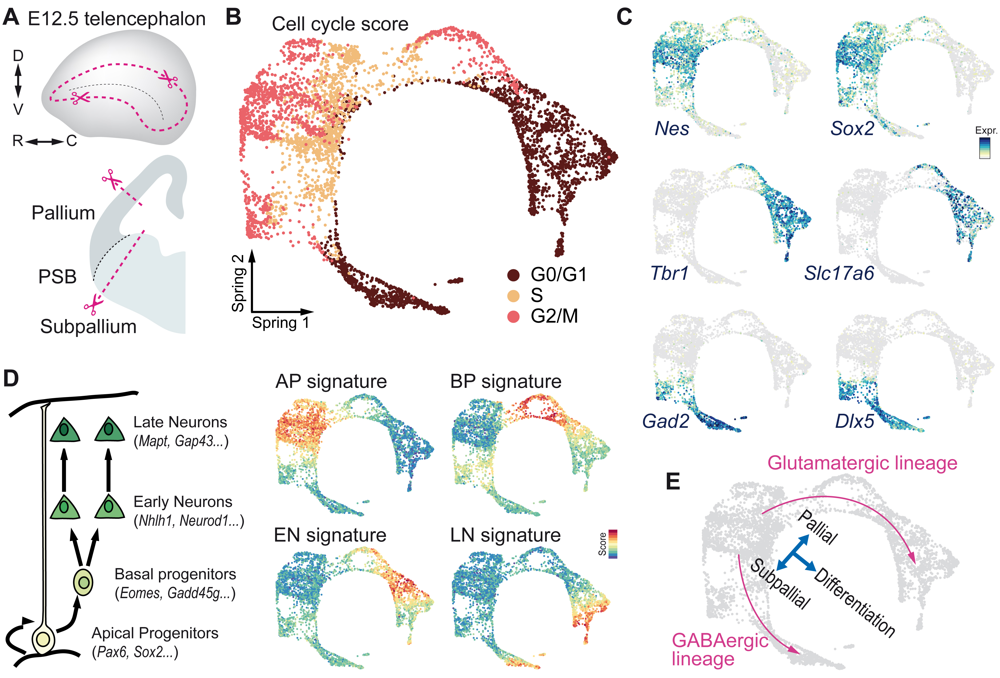](./html-Reports/Figure1.html) | [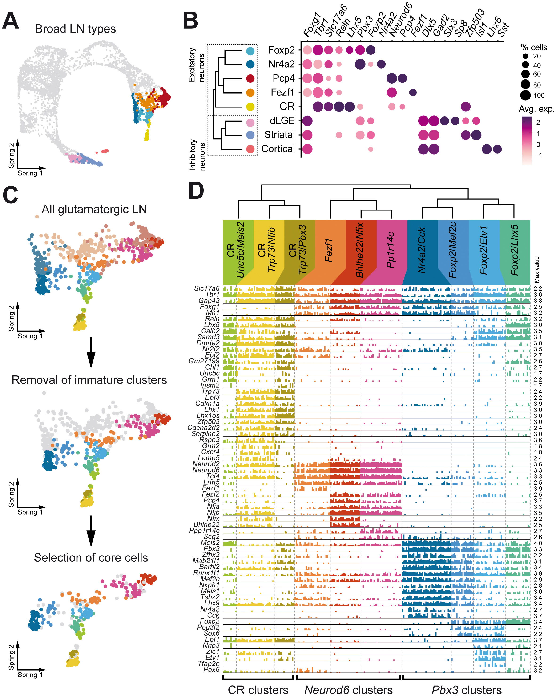](./html-Reports/Figure2.html) | 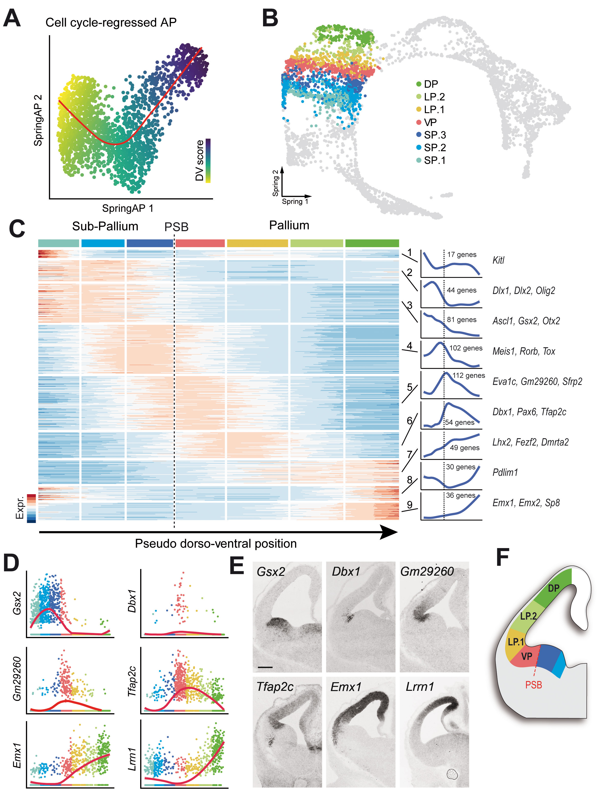 |

| Figure 6 | Figure 7 |
|-|-|
| 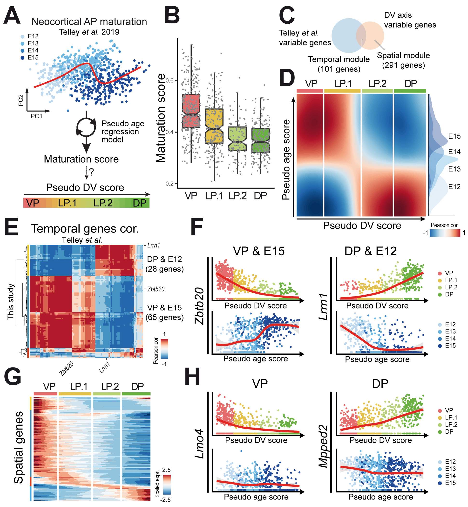 | 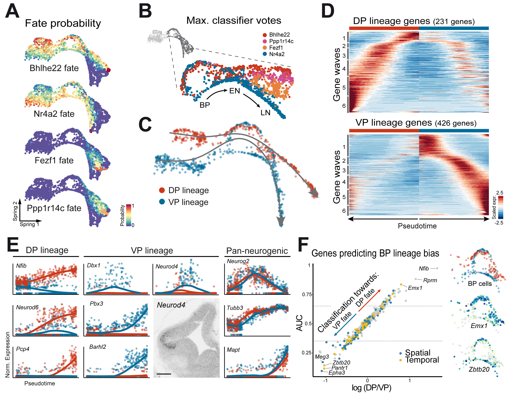 |

## Code to supplementary figures

| Figure S1 | Figure S2 | Figure S3 |
|-|-|-|
| [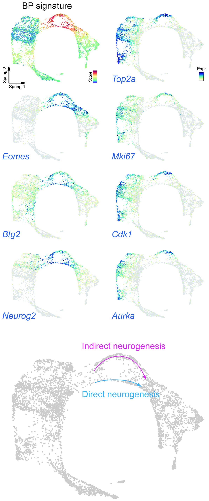](./html-Reports/FigureS1.html) | [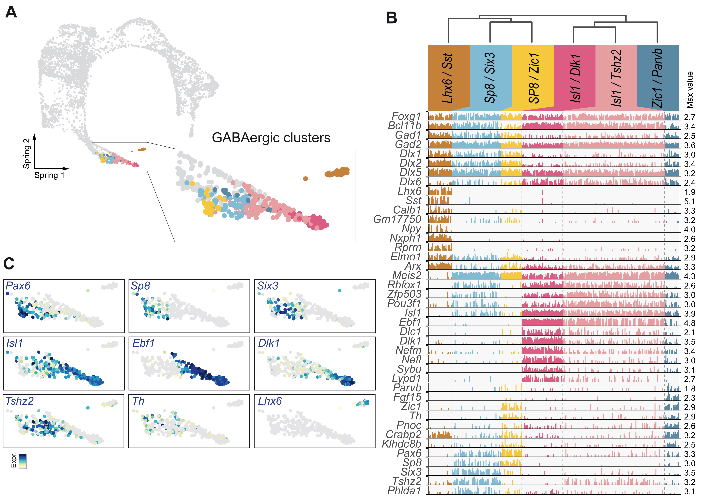](./html-Reports/FigureS2.html) | [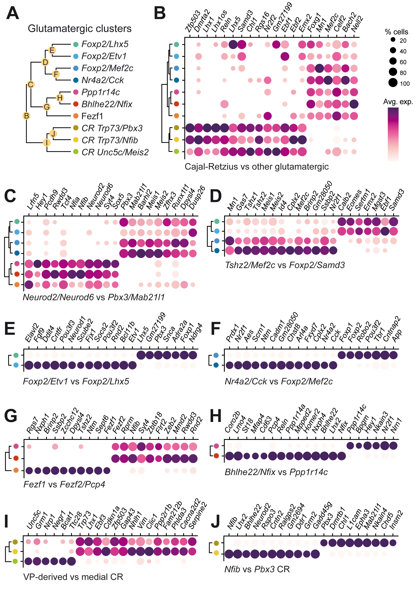](./html-Reports/FigureS3.html) |

| Figure S5 | Figure S6 | Figure S7 |
|-|-|-|
| 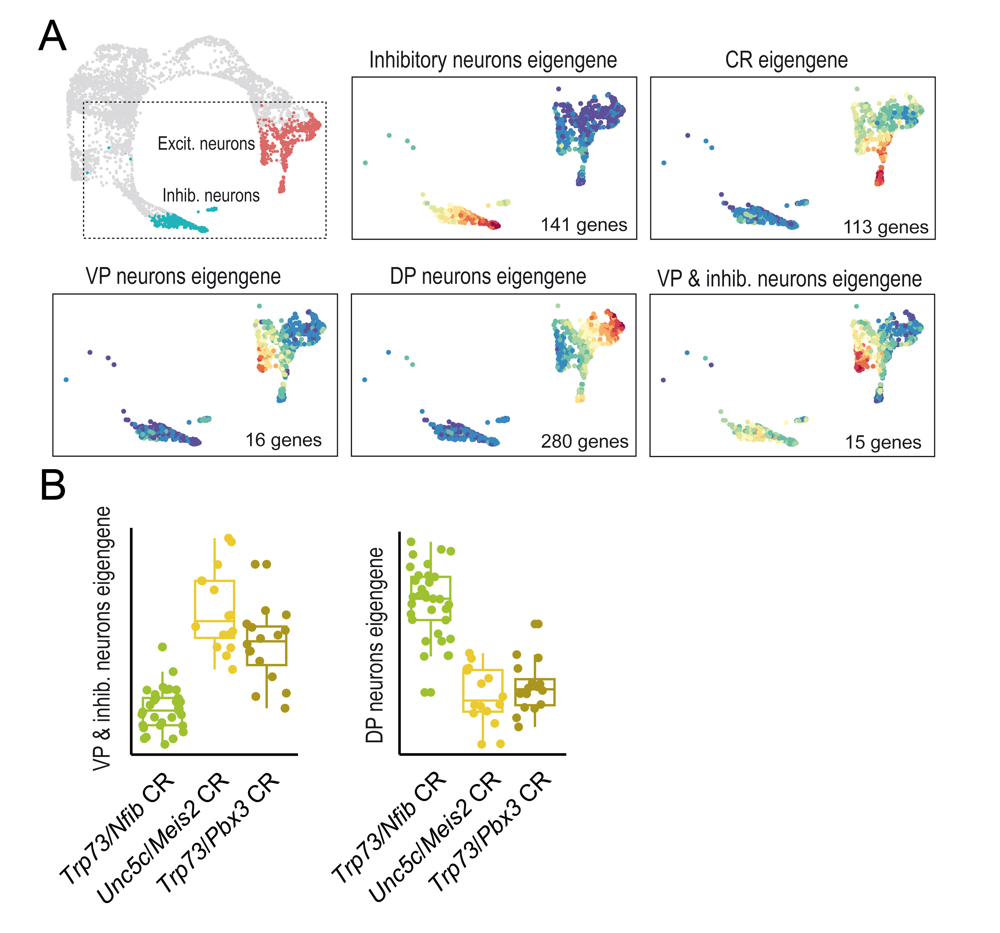 | 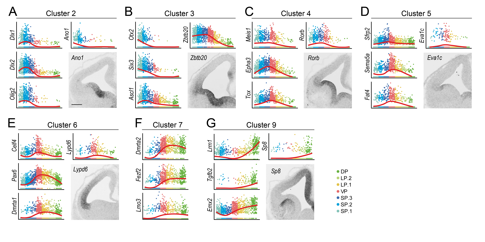 | 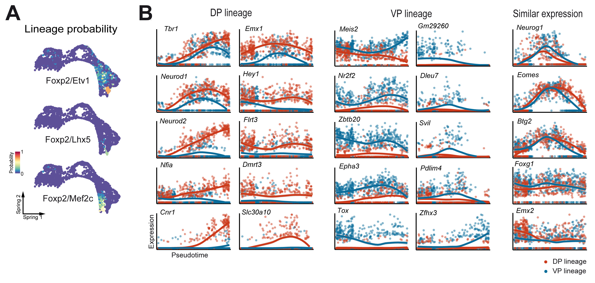 |
