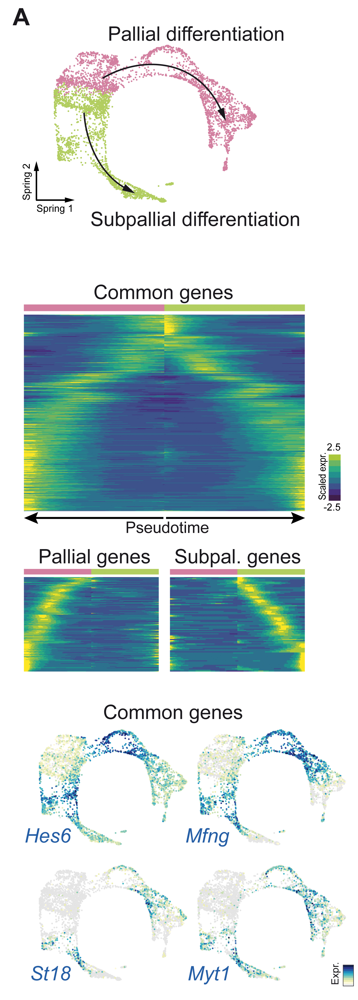
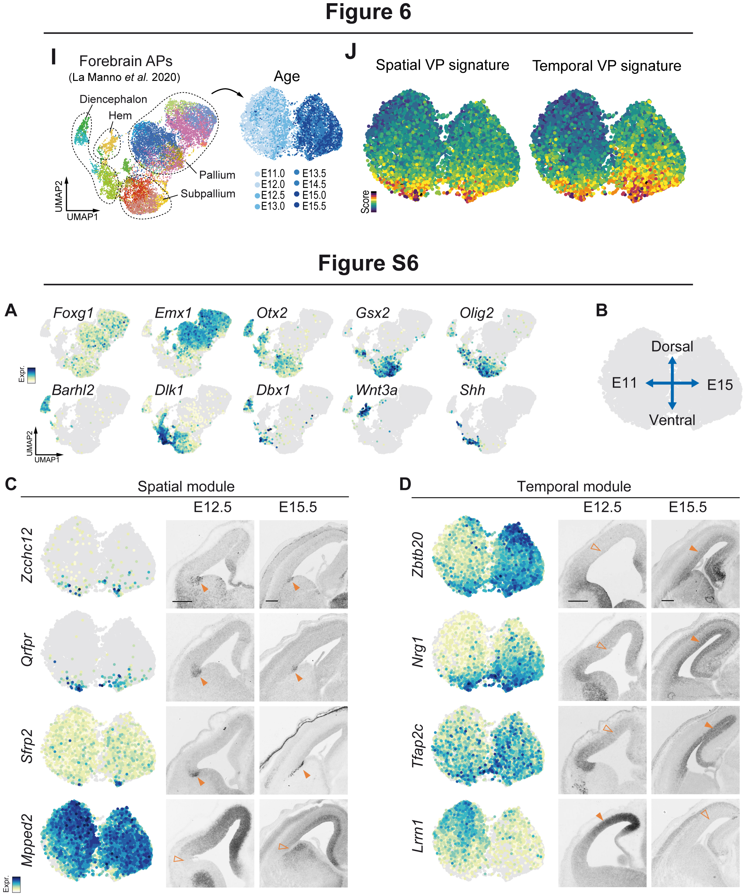

This page contains R codes and data related to the article :

*Moreau, M.X., Saillour, Y., Cwetsch, A.W., Pierani, A. & Causeret, F.* [Single-cell transcriptomics of the early developing mouse cerebral cortex disentangles the spatial and temporal components of neuronal fate acquisition](https://doi.org/10.1242/dev.197962) Development 15 July 2021; 148 (14): dev197962. (link to the initial *[BioRxiv preprint](https://doi.org/10.1101/2020.11.27.401398)*)

### Download raw and processed dataset

- Raw count matrix has been in GEO (GSE161605) and can be dowloaded [here](https://www.ncbi.nlm.nih.gov/geo/download/?acc=GSE161605&format=file)
- Sequencing reads are available on the [ENA](https://www.ebi.ac.uk/ena/browser/view/SRX9519507)

- Cells' metadata files in csv format can be retreived from this repository [here](https://github.com/MatthieuXMoreau/EarlyPallialNeurogenesis/blob/main/data/metadata) 

### Links to main figures RMarkdown reports

[Preprocessing analysis report](./html-Reports/Quality_Control.html)

| Figure 1 | Figure 2 | Figure 5 |
|-|-|-|
|  |  |  |

| Figure 6 | Figure 7 |
|-|-|
|  |  |

### Links to supplementary figures RMarkdown reports

| Figure S1A | Figure S1B | Figure S2 | Figure S3 |
|-|-|-|-|
|  |  |  |  |

| Figure S5 | Figure S6 | Figure S7 |
|-|-|-|
|  |  |  |
